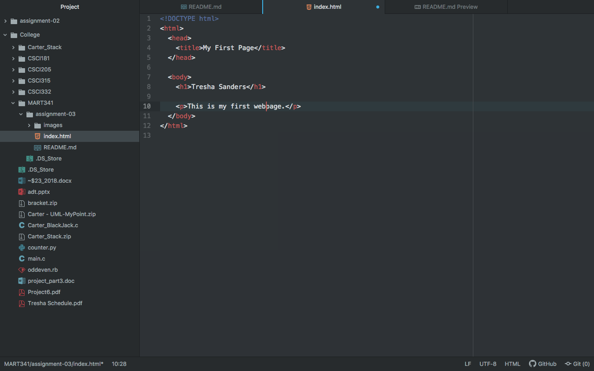

# Assignment 03

1. As developers, we create the individual pieces that make up a webpage (in this example). A web browser collects the pieces provided by the server, renders the information, and displays it. I mainly test any web development on Chrome as it makes up the majority of browser usage though I also test with Safari because of Apple product users.

2. A markup language is used to create the content, while other languages are used to style or manipulate the content. The most common markup language is html.

3.

