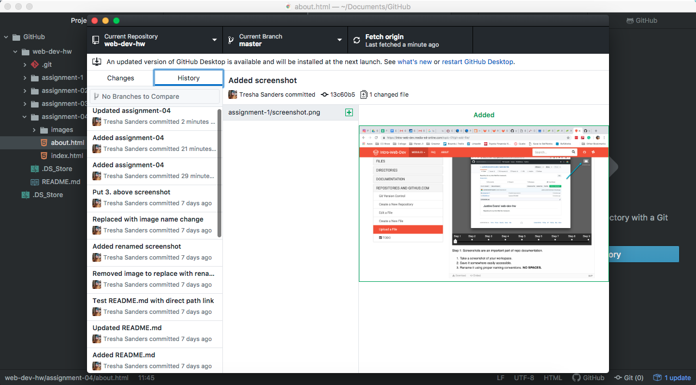

# Assignment 04

1. The first website I looked at was for a startup I worked for and built the website for. It's cobrew.com. It was fun to look at it from when I started with it [Check it out](https://web.archive.org/web/20171016213333/https://www.cobrew.com/) to when I first redesigned it [Check it out](https://web.archive.org/web/20180427104247/https://cobrew.com/). I also checked out the UM website all the way back to '97 up to the present. That was really cool to see how much it's changed.

2. I'm a big fan of GitHub and the desktop app. I've used it before for other classes. It's pretty easy to use.

3.

