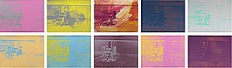

#README.md

1. Margins set the distance between content and the browser window. Padding sets the space between content and the margin. Borders surround content elements.

2. Electric Chair - Andy Warhol, 1964

3. I like Andy Warhol's stuff. While browsing the sample ideas, Electric Chair stuck out to me. I wanted to see if I could make a simple, similar creation with html and css.
